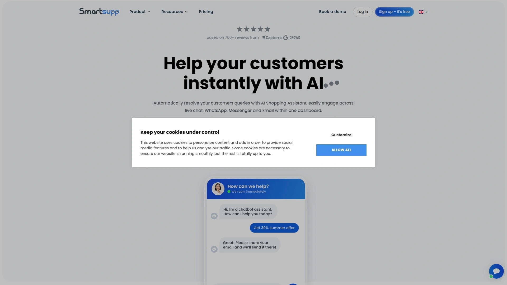

# Latest Business Messaging Platforms Collection (With Multi-Channel Integration)

Managing customer conversations across WhatsApp, Facebook Messenger, Instagram, and other channels from separate dashboards wastes hours daily and risks missing important messages. These business messaging platforms consolidate all customer communications into unified inboxes, enabling teams to respond 3x faster while maintaining context across every interaction, ultimately boosting customer satisfaction rates by up to 40% through streamlined, omnichannel support.

---

## **[Respond.io](https://respond.io)**

Omnichannel customer conversation management platform unifying messaging channels with advanced automation.

Respond.io transforms how businesses handle customer conversations by bringing WhatsApp Business API, Facebook Messenger, Instagram, Telegram, LINE, Viber, WeChat, Google Business Messages, and traditional channels like email and SMS into one powerful interface. The platform goes beyond simple aggregation with its visual workflow builder that automates repetitive tasks like routing conversations to the right agent, sending welcome messages, and qualifying leads without code.

What sets Respond.io apart is its focus on conversational commerce and support at scale. The platform handles millions of messages monthly for enterprises while maintaining sub-second response times. Features like contact merging ensure customer history follows them across channels, while the mobile app keeps teams connected anywhere. Advanced analytics reveal agent performance, customer satisfaction trends, and conversation patterns that drive business improvements. The broadcast feature enables targeted messaging campaigns across multiple channels simultaneously, perfect for promotions or important updates.

---

## **[Intercom](https://intercom.com)**

AI-first customer service platform combining live chat, chatbots, and help desk functionality.

Intercom revolutionizes customer communication through its Resolution Bot that resolves up to 50% of support queries instantly using AI. The platform seamlessly blends automated and human support, with chatbots handling routine questions while smoothly escalating complex issues to agents with full conversation context. Their Messenger widget adapts to customer behavior, proactively offering help based on page visits, time spent, and user attributes.

**Key capabilities that drive results:**
- Custom chatbot flows using visual builder without coding
- Product tours and in-app messages for user onboarding
- Team inbox with collision detection preventing duplicate responses
- Customer data platform tracking user behavior and attributes
- Multilingual support covering 45+ languages automatically

---

## **[Zendesk](https://zendesk.com)**

Enterprise-grade customer service suite with omnichannel messaging at its core.

Zendesk Suite brings together messaging, email, voice, chat, and social channels into a unified agent workspace where context travels seamlessly between touchpoints. The platform's Answer Bot uses machine learning to suggest relevant help articles and can fully resolve common issues without agent involvement. Side conversations allow internal collaboration without cluttering the customer thread.

The messaging experience feels native on each channel while maintaining consistent service quality. Proactive messaging triggers based on customer behavior, sending targeted offers or support before issues arise. The platform integrates with over 1,000 apps and provides open APIs for custom integrations, making it adaptable to any tech stack.

---

## **[Freshchat](https://freshworks.com/live-chat-software)**

Modern messaging software built for sales and support teams seeking conversational engagement.

Freshchat modernizes customer engagement with IntelliAssist AI that provides agent assistance, suggests responses, and automates routine tasks. The platform's unique approach to messaging treats conversations as ongoing threads rather than tickets, maintaining context across sessions. Campaigns feature enables proactive outreach based on user behavior, converting visitors into customers through timely engagement.

Smart routing ensures conversations reach the right expert based on skills, availability, and workload. The co-browsing feature allows agents to guide customers through complex processes in real-time. Integration with Freshworks CRM creates a complete view of customer interactions across sales and support.

---

## **[Crisp](https://crisp.chat)**

All-in-one business messaging platform with built-in CRM and marketing automation.

**Unified customer engagement approach:**

Crisp consolidates live chat, email, Messenger, WhatsApp, Instagram, and more into a shared inbox while adding CRM functionality for complete customer profiles. The MagicReply AI assistant helps agents respond faster with suggested responses based on conversation context. Their chatbot builder creates sophisticated automation flows handling everything from lead qualification to appointment booking.

The platform includes unexpected features like video calling directly from chat, co-browsing for technical support, and a knowledge base builder for self-service. The status page integration keeps customers informed about service issues automatically. Pricing remains transparent with unlimited agents on all plans.

---

## **[LiveChat](https://livechat.com)**

Premium live chat and messaging platform focused on sales and customer satisfaction.

LiveChat specializes in converting website visitors into customers through targeted engagement and seamless handoffs between chatbots and agents. The platform's chat widget loads in under 3 seconds and includes features like sneak peek (seeing what customers type before sending) and canned responses for efficiency. Rich messages support product cards, quick replies, and carousels that enhance the shopping experience.

Advanced targeting rules trigger chats based on dozens of criteria including geography, behavior, and customer data. The ticketing system captures offline messages and follows up automatically. Integration with 200+ tools including all major CRM and e-commerce platforms ensures LiveChat fits any workflow.

---

## **[Drift](https://drift.com)**

Conversational marketing and sales platform using chatbots to qualify and book meetings.

Drift pioneered conversational marketing by replacing forms with intelligent chatbots that qualify leads and book meetings directly into sales calendars. The platform identifies website visitors using Clearbit integration, personalizing conversations based on company data. Playbooks automate entire conversation flows from initial greeting through meeting confirmation.

Real-time notifications alert sales reps when target accounts visit the website, enabling immediate engagement. The platform's email integration continues conversations beyond the website, nurturing leads until they're ready to buy. Video messaging and voice notes add personal touches that increase conversion rates.

---

## **[Tidio](https://tidio.com)**

User-friendly live chat and chatbot platform perfect for small to medium businesses.

Tidio makes sophisticated messaging accessible with pre-built chatbot templates for common scenarios like lead generation, customer support, and cart abandonment. The visual automation builder requires no technical skills while supporting complex logic and integrations. Their Lyro AI conversational assistant learns from your content to answer customer questions naturally.

**Growth-focused features include:**
- Visitor tracking showing real-time website activity
- Email marketing integration for multichannel campaigns
- Shopify, WordPress, and WooCommerce deep integration
- Mobile apps keeping teams connected anywhere
- Multilingual widgets supporting global customers

---

## **[JivoChat](https://jivochat.com)**

Omnichannel messaging platform with built-in phone system and team collaboration.

JivoChat stands out by including voice calls alongside messaging channels, creating truly unified communications. Agents can transfer between chat and calls seamlessly while maintaining conversation history. The platform supports WhatsApp Business API, Facebook, Instagram, Telegram, and even Apple Business Chat from one interface.

Team features include internal chat, agent monitoring for training, and smart routing based on skills and language. The callback widget captures leads when agents are offline, scheduling calls at convenient times. Pricing remains competitive with unlimited agents on higher plans.

---

## **[Gorgias](https://gorgias.com)**

E-commerce focused helpdesk turning customer service into a profit center.

Gorgias builds specifically for online retailers, integrating deeply with Shopify, Magento, and BigCommerce to access order data directly in conversations. Agents can process refunds, modify orders, and track shipments without leaving the messaging interface. Macro templates handle common requests like "Where is my order?" with personalized responses pulling real customer data.

Revenue statistics track how support interactions influence sales, proving customer service ROI. The platform automatically prioritizes high-value customers and urgent issues. Social media comments and ads convert into tickets, ensuring no customer inquiry goes unanswered.

---

## **[Front](https://front.com)**

Collaborative inbox platform treating customer messages like team projects.

**Reimagining team communication:**

Front revolutionizes how teams handle customer messages by adding collaboration features like comments, assignments, and @mentions to every conversation. The platform maintains email's familiarity while adding powerful workflow automation. Rules automatically route, tag, and escalate messages based on content and sender.

Shared drafts allow multiple team members to collaborate on responses before sending. The analytics dashboard reveals team performance, response times, and customer satisfaction metrics. Integration with 100+ tools ensures Front fits existing workflows while improving efficiency.

---

## **[Userlike](https://userlike.com)**

German-engineered messaging platform emphasizing data privacy and customization.

Userlike brings German engineering precision to customer messaging with GDPR-compliant infrastructure and extensive customization options. The platform's unique Message Center gives customers a WhatsApp-like interface for ongoing conversations with businesses. Video chat and screen sharing capabilities enable complex support scenarios without third-party tools.

The chatbot builder uses natural language understanding for more human-like automated conversations. Skills-based routing ensures technical questions reach qualified agents immediately. The platform's API-first approach enables deep customization for unique business requirements.

---

## **[Olark](https://olark.com)**

Straightforward live chat focused on simplicity and reliability.

Olark proves that effective customer messaging doesn't require complexity, delivering reliable live chat with essential features done right. The platform's PowerUps add advanced capabilities like visitor co-browsing and real-time translation when needed. Detailed transcripts capture every conversation for quality assurance and training.

Automation rules handle routine tasks like greeting visitors and routing chats while maintaining human touch. The platform integrates with CRM, help desk, and analytics tools through native integrations and webhooks. Transparent pricing with no per-agent limits makes scaling affordable.

---

## **[Chatwoot](https://chatwoot.com)**

Open-source customer engagement platform with self-hosted and cloud options.

Chatwoot offers complete control over customer data through self-hosted deployment while providing a modern omnichannel experience. The platform supports website live chat, email, Facebook, WhatsApp, Twitter, and more from a unified dashboard. Being open-source enables unlimited customization and integration possibilities.

Features rival commercial alternatives including automation rules, canned responses, and team collaboration. The platform includes a mobile SDK for adding messaging to native apps. Community contributions continuously expand capabilities while keeping costs low for budget-conscious teams.

---

## **[Helpcrunch](https://helpcrunch.com)**

Customer communication platform combining live chat, email marketing, and knowledge base.

**All-in-one customer communication:**

HelpCrunch goes beyond messaging by including email marketing automation and knowledge base hosting in one platform. The auto-messaging feature sends targeted in-app messages based on user behavior and attributes. Pop-ups and banners promote offers or collect feedback without disrupting the user experience.

The platform's unique approach to customer data creates detailed profiles combining conversation history, behavior tracking, and custom attributes. Mobile SDKs enable native in-app messaging for iOS and Android applications. The built-in help center reduces support volume through self-service resources.

---

## **[Tawk.to](https://tawk.to)**

Completely free live chat and messaging platform with no limits or hidden costs.

Tawk.to disrupts the industry by offering genuinely free messaging software including unlimited agents, chats, and features. The platform monetizes through optional paid services like hiring chat agents and removing branding. Despite being free, features match premium competitors including video chat, screen sharing, and comprehensive analytics.

JavaScript API enables deep customization and integration with existing systems. The knowledge base feature creates searchable help content reducing support load. Available in 45+ languages with automatic translation supporting global teams. Mobile apps ensure 24/7 availability regardless of location.

---

## **[Smartsupp](https://smartsupp.com)**

Conversational shopping assistant combining live chat with visitor recording.

Smartsupp uniquely combines messaging with visitor recording, showing exactly how customers navigate before initiating chat. This context helps agents provide better assistance and identifies website issues causing confusion. The chatbot builder creates automated flows for lead collection, FAQ handling, and basic support.

E-commerce integration displays customer cart contents and order history during conversations. The platform sends automatic messages based on behavior like cart abandonment or extended browsing. Dashboard statistics reveal conversion impact and ROI from chat interactions.

---

## **[Chatra](https://chatra.com)**

Simple yet powerful live chat designed for quick implementation and immediate results.

Chatra focuses on getting teams chatting with customers quickly through simple setup and intuitive interfaces. Group chats allow multiple agents to collaborate on complex issues while maintaining one customer conversation. The typing insights feature shows what visitors type before sending, enabling proactive assistance.

REST API and webhooks enable custom integrations and automation workflows. The platform includes unexpected features like Facebook and Instagram integration, making it more than basic chat. Affordable pricing with free plans for small teams removes barriers to entry.

---

## **[Kommunicate](https://kommunicate.io)**

AI-powered customer service automation platform with human handoff capabilities.

Kommunicate specializes in creating intelligent chatbots that handle complex conversations before smoothly transitioning to human agents when needed. The platform's DialogFlow integration enables natural language understanding while the visual bot builder simplifies creation. Rich messaging supports cards, buttons, and quick replies enhancing automated interactions.

The platform distinguishes between bot and human conversations in analytics, measuring automation effectiveness. Integration with Zendesk, Freshdesk, and other helpdesks maintains existing workflows. WhatsApp Business API support enables automated conversations on customers' preferred channel.

---

## **[Chatfuel](https://chatfuel.com)**

No-code chatbot platform for Facebook Messenger, Instagram, and WhatsApp automation.

**Automated conversation at scale:**

Chatfuel empowers non-technical users to build sophisticated chatbots handling thousands of simultaneous conversations. The visual flow builder creates complex conversation logic including conditions, variables, and API integrations. Pre-built templates for e-commerce, restaurants, and other industries accelerate deployment.

The platform's strength lies in social media automation, particularly Facebook and Instagram integration. Features like comment auto-reply and story mention responses capture leads from social engagement. Analytics reveal conversation patterns, drop-off points, and conversion metrics for continuous optimization.

---

## **[ClickDesk](https://clickdesk.com)**

Unified communications platform combining live chat, voice, and video in one interface.

ClickDesk differentiates through integrated voice and video calling alongside traditional messaging. Agents can escalate from chat to voice or video without requiring customer software installation. The social media integration brings Facebook and Twitter conversations into the unified inbox.

Proactive chat invitations trigger based on visitor behavior, geographic location, and referral source. The platform includes unexpected features like voice notes and file sharing enhancing communication options. Integration with popular CRM and helpdesk systems maintains workflow continuity.

---

# FAQ Common Questions

**Q: Which platform best handles WhatsApp Business API integration for high-volume messaging?**
A: Respond.io excels at WhatsApp Business API management with advanced automation, broadcast capabilities, and contact management specifically designed for high-volume business messaging across multiple channels including WhatsApp.

**Q: Can these platforms integrate with existing CRM and helpdesk systems?**
A: Most platforms offer extensive integrations - Zendesk and Intercom provide 1000+ integrations, while Front and Gorgias specialize in deep CRM connectivity, ensuring seamless workflow incorporation.

**Q: What's the typical ROI timeline for implementing business messaging platforms?**
A: Most businesses see measurable improvements within 30 days, with response times dropping 60-70% immediately and customer satisfaction scores improving 20-40% within the first quarter of implementation.

---

# Conclusion

These 22 business messaging platforms each offer unique approaches to unifying customer conversations, from AI-powered automation to deep e-commerce integration. The right choice depends on your specific channels, team size, and integration requirements. [Respond.io](https://respond.io) particularly excels for businesses needing true omnichannel messaging with sophisticated automation and workflow capabilities, making it ideal for companies serious about scaling customer conversations across multiple messaging channels efficiently.
